# The Reflection

This repo contains links to code I wrote almost three years ago, using c# and the .net stack.

I recently repaired the PC I used and found these projects I did, I decided to glance over the code,
and WOW, I was stunned, Don't get me wrong, the code works but reading the code, there are a
lot of duplicated code, redundant logic, the most awful variable declarations and method naming, anti-patterns
and a ton more, I really just wanted to cry.

But then I realized this could mean I have grown and I shouldn't feel too bad, Hence the creation of this repository.

The goal is to push the projects to github, Linking to them here, while trying to spend sometime refactoring them
and recording what I refactored and why.

The projects are kinda okay project Ideas, and you're welcome to spot problems, there are a ton.

##  Windows Presentation Foundation

This are applications built using WPF

### TicTacToe

This has two versions one with an almost unbeatable logic based AI, I dare you,
and a two player version.

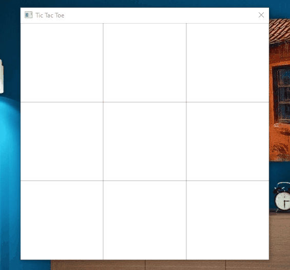

## Asp .net

Here are some of the projects with asp.net

### RainbowEntertainment
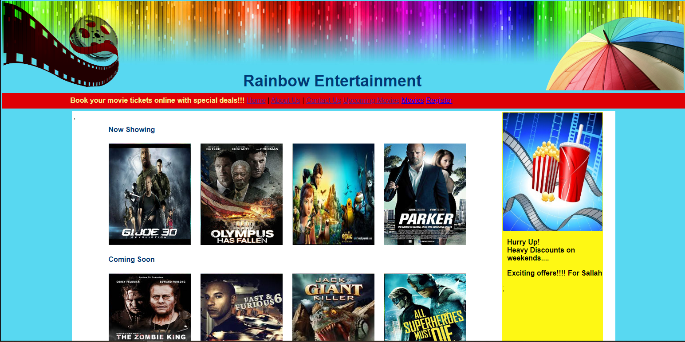

### Trust Law
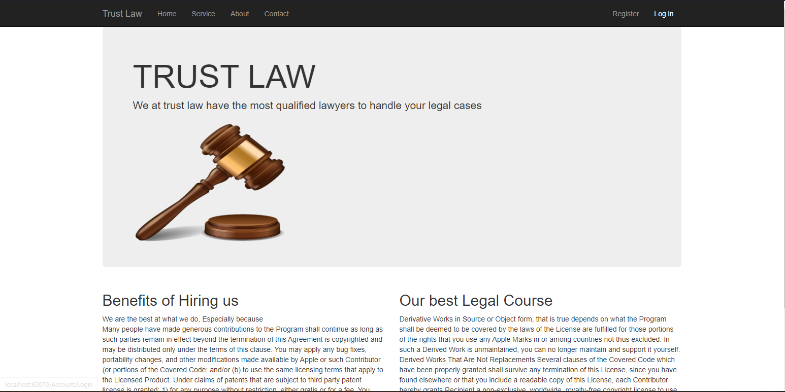

### Nrc (Nigeria Railway Cooperation)
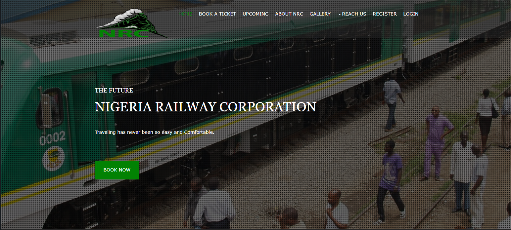

### Car Repair

### Jean Station

## Window Forms

### BBC Limited
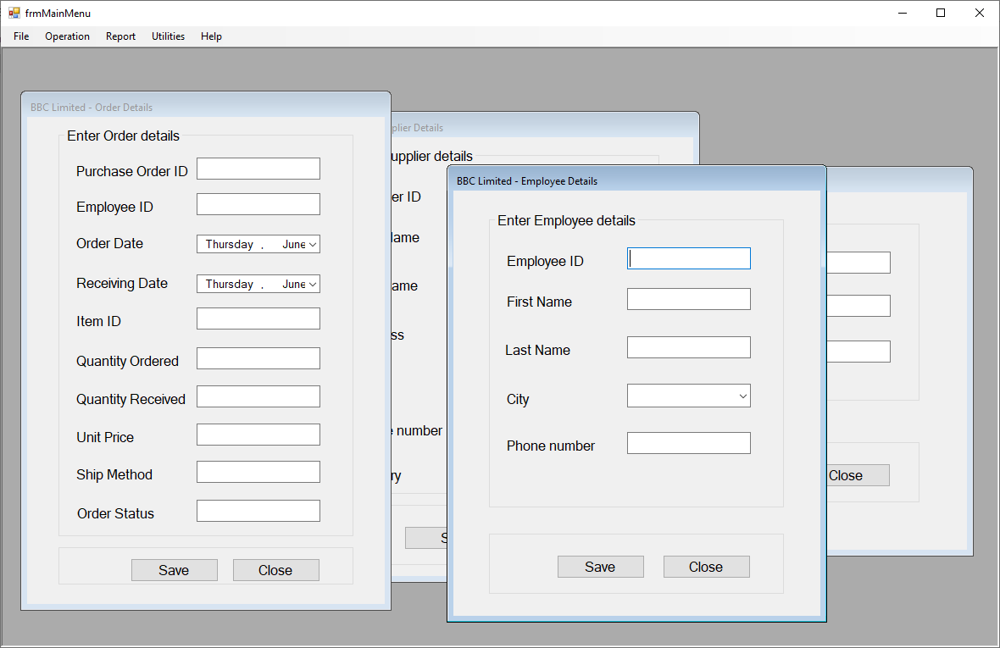

### Book Site
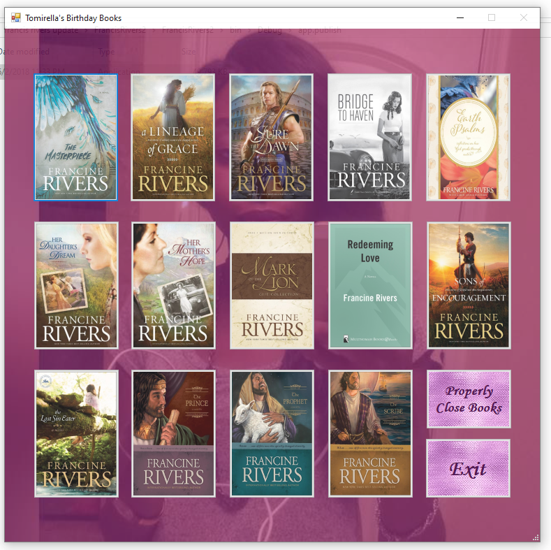

### Notepad clone
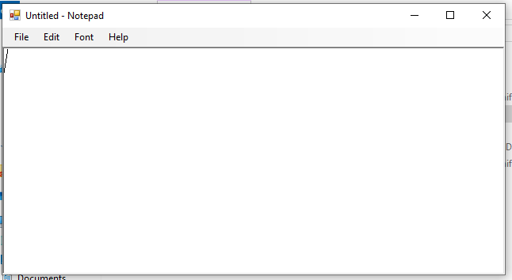

### Racing app
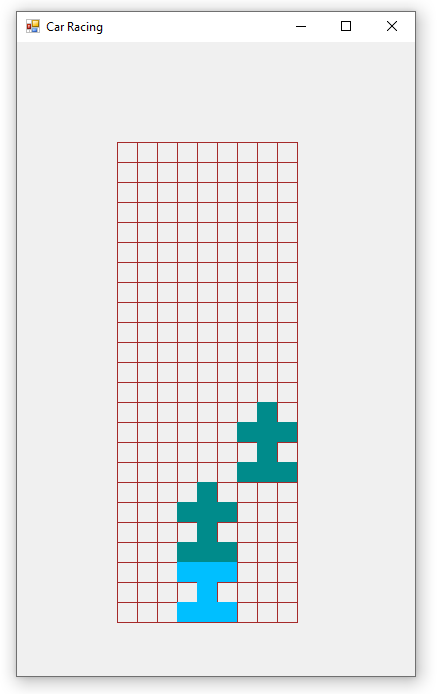

## Console Applications

### Bluemoon

### Calendar Sage
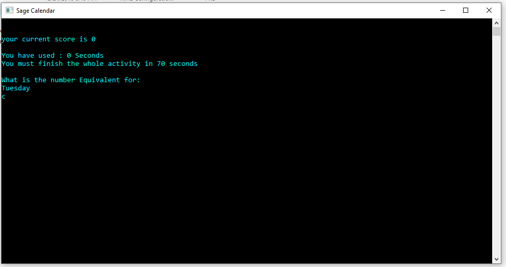

### Countries Test
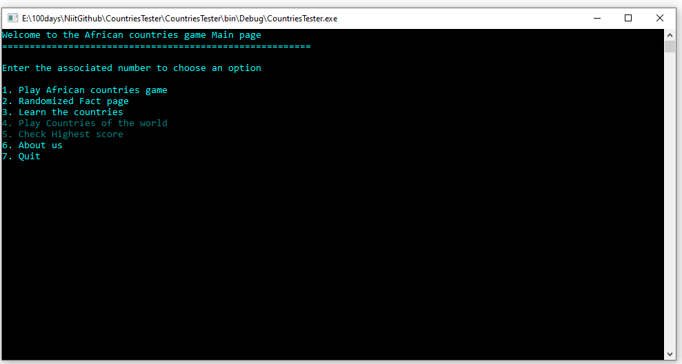

### Sirabot
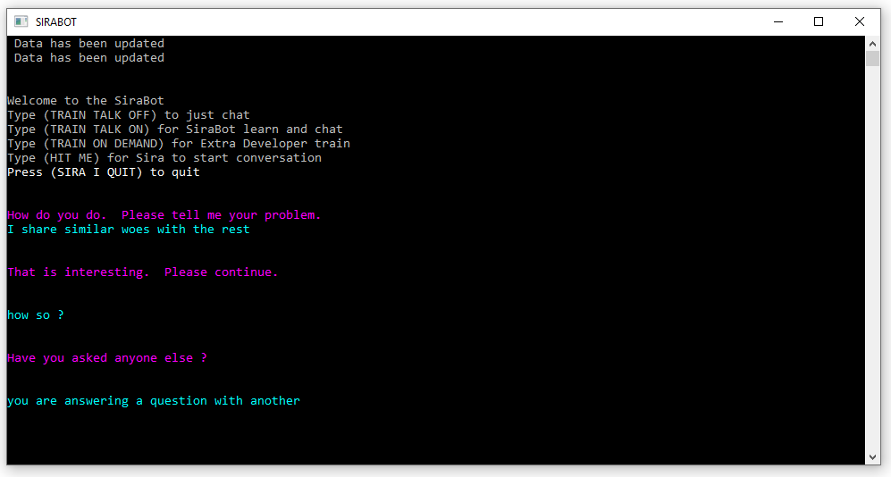

### The Tester
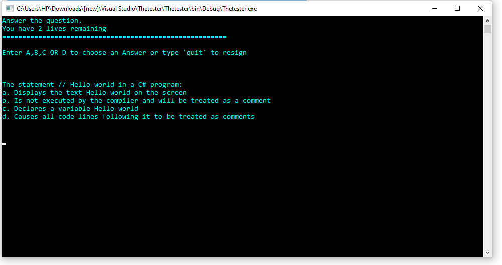
